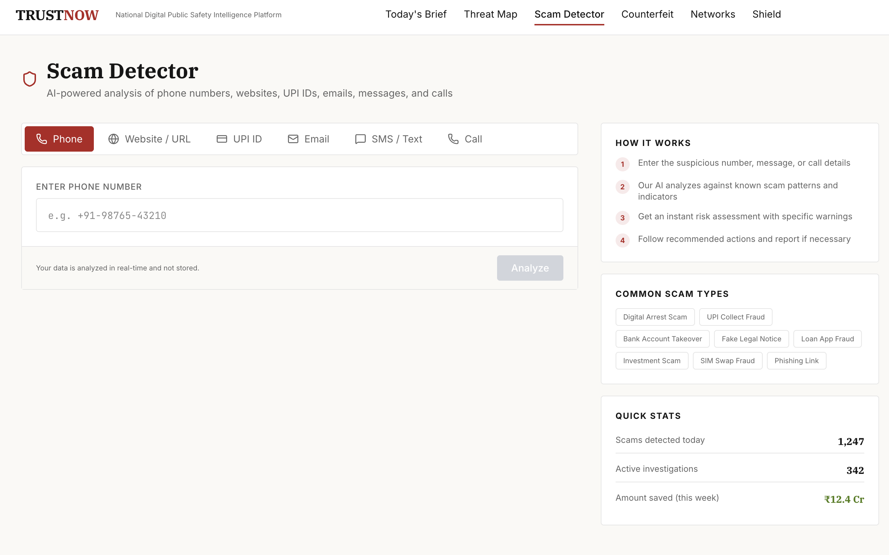

# TrustNow

> AI-powered National Digital Public Safety Intelligence Platform


TrustNow is an AI-powered fraud intelligence platform designed to help citizens identify scams and provide investigators with real-time threat intelligence across India.

The platform combines AI analysis, fraud detection, geospatial visualization, counterfeit verification, and relationship mapping into a unified public safety dashboard.

Built during a hackathon using modern web technologies and public intelligence APIs, TrustNow addresses some of India's most common digital frauds, including:

- Digital Arrest Scams
- UPI Fraud
- Phishing Websites
- Fake Legal Notices
- Loan App Fraud
- SIM Swap Attacks
- Investment Scams
- Counterfeit Currency

---

# Features

## Today's Brief

A real-time national intelligence dashboard providing a live overview of fraud activity.

### Highlights

- Live scam feed
- National threat statistics
- Active alerts
- Interactive threat map
- Regional scam trends
- Intelligence overview


---

## Scam Detector

Analyze suspicious digital activity using AI.

Supports analysis of:

- Phone Numbers
- Website URLs
- UPI IDs
- Email Addresses
- SMS Messages
- Voice Calls

Results include:

- Risk Score
- Threat Classification
- AI Explanation
- Recommended Actions



---

## Fraud Shield

An AI-powered assistant that helps citizens verify suspicious calls, messages, and payment requests through natural conversation.

Features:

- Conversational AI
- Scam Detection
- Safety Recommendations
- Direct Reporting Guidance
- Educational Scam Library


---

## Threat Map

Visualize fraud incidents across India using an interactive geospatial dashboard.

Features:

- Heatmap View
- Marker View
- City-Level Analysis
- Threat Categories
- Live Incident Monitoring


---

## Counterfeit Scanner

AI-powered counterfeit currency verification.

The scanner analyzes Indian currency notes using multiple security checks.

Features:

- Watermark Detection
- Security Thread Verification
- Serial Number Validation
- Microprint Analysis
- UV Feature Verification


---

## Fraud Network

Relationship intelligence for investigators.

Visualize hidden connections between:

- Phone Numbers
- Bank Accounts
- Email Addresses
- Devices
- Locations
- Reported Cases

Designed to help investigators identify coordinated fraud operations and connected entities.


---

# Technology Stack

### Frontend

- React 19
- TypeScript
- Vite
- Tailwind CSS

### Backend

- Python
- FastAPI
- Pydantic

### Visualization

- Leaflet
- React Flow
- Recharts

### AI & Intelligence

- GitHub Models API (optional)
- CallTracer
- SnifURL
- Rule-based Fallback Engine

---

# Getting Started

## Prerequisites

- Node.js 20+
- Python 3.12+

## Installation

```bash
# Install frontend
cd frontend
npm install

# Install backend
cd ../backend
pip install -r requirements.txt
```

## Run Backend

```bash
uvicorn app.main:app --reload --port 8000
```

## Run Frontend

```bash
cd frontend
npm run dev
```

Open:

```
http://localhost:5173
```

---

# Optional AI Configuration

For AI-powered explanations, create a GitHub Personal Access Token and set:

```bash
export AI_API_KEY=YOUR_GITHUB_TOKEN
```

Without a token, TrustNow automatically falls back to its built-in heuristic analysis.

---

# Project Structure

```
trustnow/
│
├── frontend/
│   ├── pages/
│   ├── components/
│   ├── layouts/
│   └── assets/
│
├── backend/
│   ├── api/
│   ├── models/
│   ├── services/
│   └── core/
│
└── README.md
```

---

# Vision

Digital fraud continues to evolve rapidly, while many citizens struggle to verify suspicious calls, websites, payment requests, and messages.

TrustNow was built to bridge that gap by combining AI-assisted analysis with real-time public threat intelligence, making fraud detection more accessible for citizens and providing investigators with a broader view of emerging scam patterns.

---

# Reporting Fraud

Report cybercrime:

https://cybercrime.gov.in

National Cybercrime Helpline:

**1930**

---

Made for Hackathons • Built with React, FastAPI and AI
